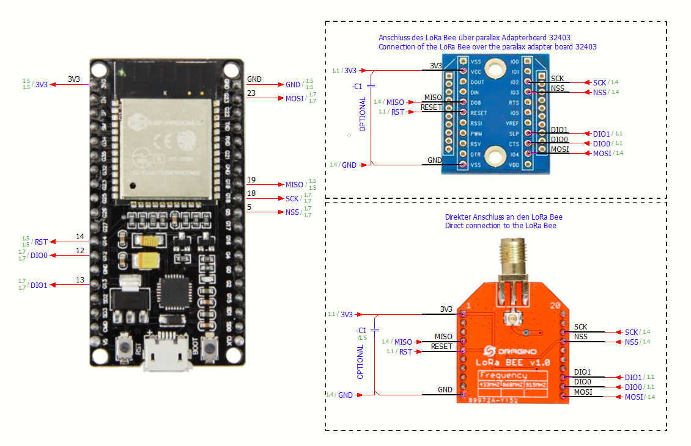

# Arduino-TTN-Single-Channel-End-Device

Example Clients to be used with single channel gateways in the things network.

To achiev an ttn join with otaa the lmic library had to be modified. The modified can be found in  01_arduino_lib. Before the lib is used, make shoure that no other lmic derivat is installed in your arduino ide.

At the moment the modified lib only works for the EU868 bandplan. Frequency is fixed to 868.3MHz. This Lib is for testing purposes only. 

Connection diagram:

  